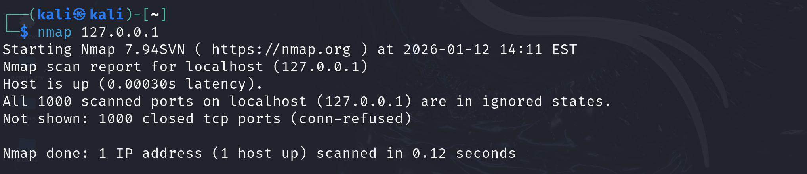
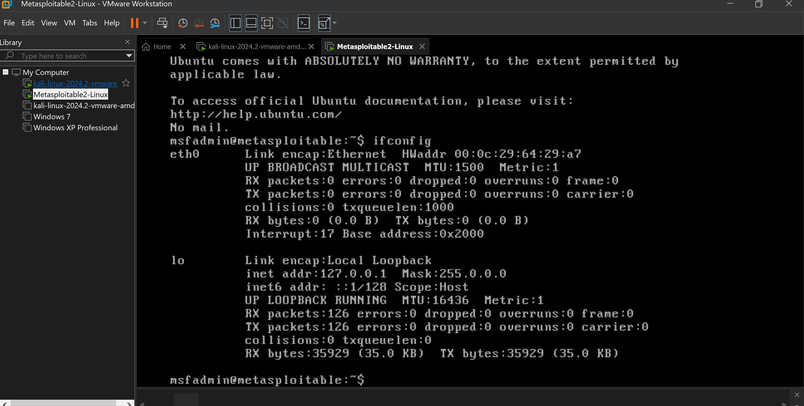
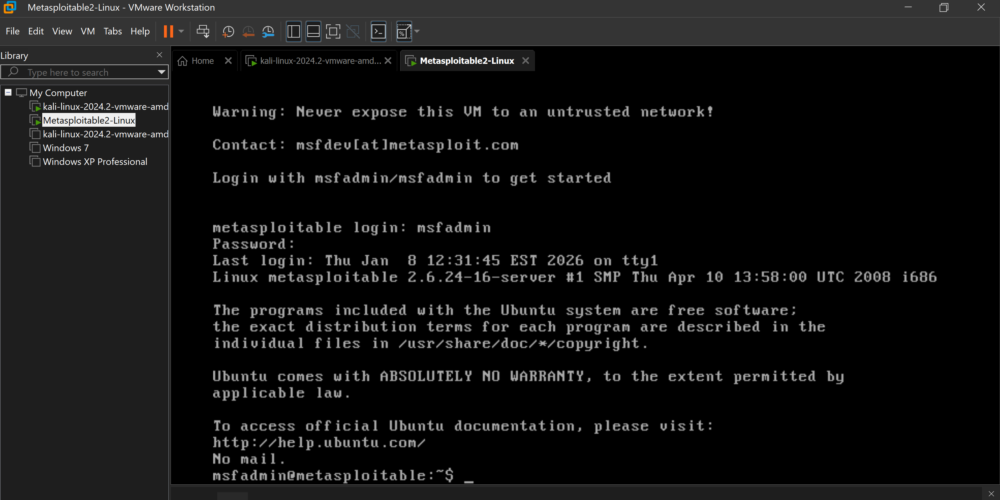
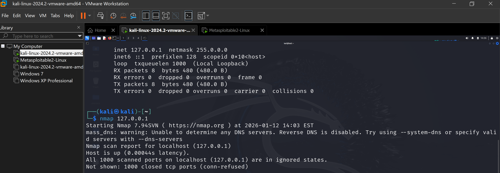
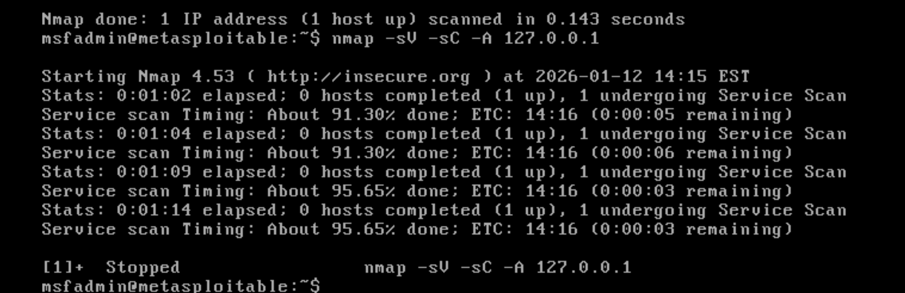
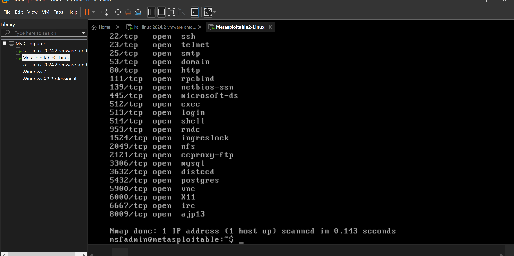

# 🛡️ Vulnerability Assessment Lab

## 📌 Overview
This lab demonstrates a basic vulnerability assessment using **Nmap** on a vulnerable virtual machine (**Metasploitable2**) from a Kali Linux attacker system. It showcases my ability to identify open ports, detect services, analyze risks, and recommend mitigations — essential skills for cybersecurity roles.

---

## 🛠️ Tools Used
- **Kali Linux** – Attacker machine  
- **Metasploitable2** – Target VM  
- **Nmap** – Network scanning tool  
- **VirtualBox / VMware** – Virtualization platform

---

## 📋 Methodology

### 1. Environment Setup
- Configured both VMs with Host-Only Adapter networking.
- Verified IP addresses using `ifconfig`.

📸 Screenshots:  
-   
-   
-   
- 

---

### 2. Nmap Scanning
- Basic scan: `nmap <target_ip>`  
- Service detection: `nmap -sV <target_ip>`  
- Vulnerability scan: `nmap --script vuln <target_ip>`  
- Saved results to `nmap_results.txt`

📸 Screenshots:  
-   
-   
- 

---

## 📊 Key Findings

| Port | Service | Risk |
|------|---------|------|
| 21   | FTP     | Anonymous login; cleartext credentials |
| 22   | SSH     | Brute force risk |
| 23   | Telnet  | Insecure cleartext authentication |
| 80   | HTTP    | Web attack surface (SQLi, XSS) |
| 3306 | MySQL   | Default credentials |

---

## ✅ Recommendations
- Disable unused services (Telnet, anonymous FTP)
- Use firewalls to restrict access
- Patch outdated software
- Enforce strong authentication
- Replace insecure protocols with secure alternatives
- Harden web server configurations

---

## 📁 Files Included
- `Vulnerability_Assessment_Lab.pdf` – Lab instructions and setup  
- `vulnerability_assessment_lab_report.pdf` – Final report with findings and recommendations  
- `screenshots/` – Visual evidence of setup and scan results  
  - [View all screenshots](https://github.com/Azizulhaq-professional/Aziz-Cybersecurity-Labs/tree/main/01_Vulnerability_Assessment_Lab/screenshots)

---

## ⚠️ Disclaimer
This lab was conducted in a **controlled environment** using intentionally vulnerable systems.  
**Do not scan unauthorized systems.**

---

## ✍️ Author
**Aziz Ul Haq**  
Cybersecurity Enthusiast | SOC & SIEM Projects | Ethical Hacking Labs
