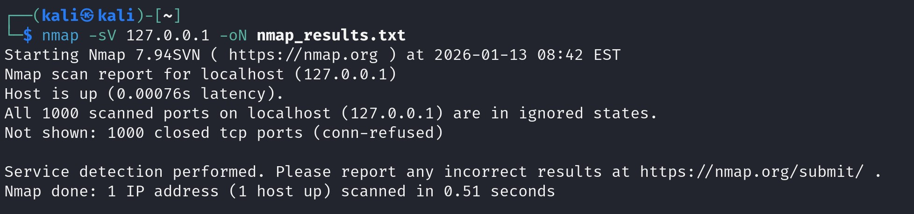

# 🛡️ Network Vulnerability Assessment Using Nmap

## 📌 Overview
This project demonstrates a basic vulnerability assessment using **Nmap** on a test machine (**Metasploitable2**) in a controlled lab environment. It showcases my ability to identify open ports, detect services, analyze risks, and recommend mitigations — foundational skills for cybersecurity roles.

---

## 🛠️ Tools Used
- **Kali Linux** – Attacker machine  
- **Metasploitable2** – Target VM  
- **Nmap** – Network scanning tool  
- **VirtualBox / VMware** – Virtualization platform

---

## 📋 Methodology

1. **Environment Setup**
   - Configured both VMs with Host-Only Adapter networking.
   - Identified target IP using `ifconfig`.  
       
     

2. **Nmap Scanning**
   - Basic scan: `nmap <target_ip>`  
     
   - Service detection: `nmap -sV <target_ip>`  
     
   - Vulnerability scan: `nmap --script vuln <target_ip>`  
     

3. **Result Analysis**
   - Identified risks such as FTP anonymous login, SSH brute force, and HTTP vulnerabilities.
   - Documented findings in `report.pdf`.

---

## 📊 Key Findings

| Port | Service | Risk |
|------|---------|------|
| 21   | FTP     | Anonymous login; cleartext credentials |
| 22   | SSH     | Brute force risk |
| 23   | Telnet  | Insecure cleartext authentication |
| 80   | HTTP    | Web attack surface (SQLi, XSS) |
| 3306 | MySQL   | Default credentials |

---

## ✅ Recommendations
- Disable unused services (Telnet, anonymous FTP)
- Use firewalls to restrict access
- Patch outdated software
- Enforce strong authentication
- Replace insecure protocols with secure alternatives
- Harden web server configurations

---

## 📁 Files Included
- `report.pdf` – Full analysis and recommendations  
- `nmap_results.txt` – Raw scan output  
- `screenshots/` – Visual evidence of setup and findings  
  - [View all screenshots](https://github.com/Azizulhaq-professional/Aziz-Cybersecurity-Labs/tree/main/network-vulnerability-assessment-nmap/screenshots)

---

## ⚠️ Disclaimer
This lab was conducted in a **controlled environment** using intentionally vulnerable systems.  
**Do not scan unauthorized systems.**

---

## ✍️ Author
**Aziz Ul Haq**  
Cybersecurity Enthusiast | SOC & SIEM Projects | Ethical Hacking Labs  

