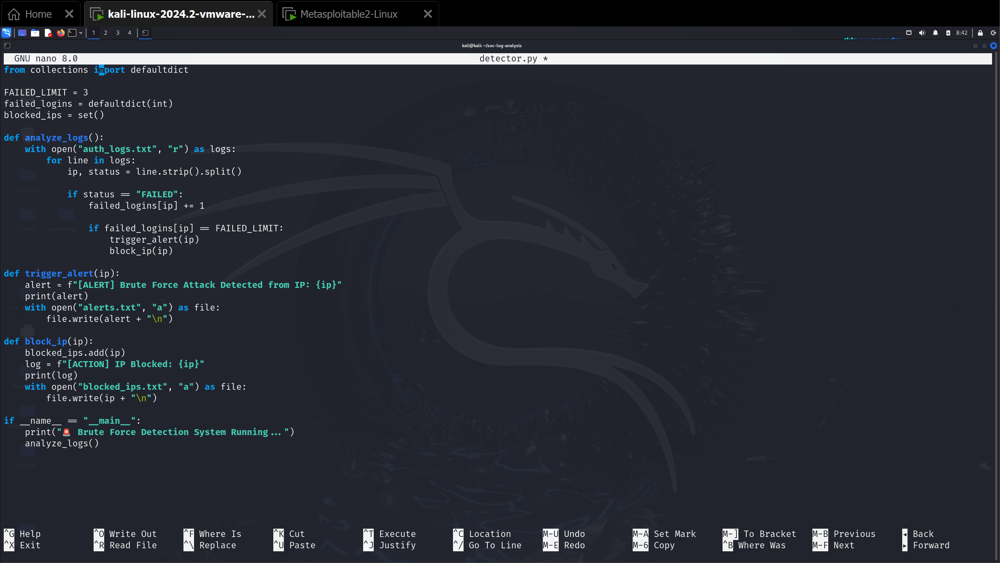
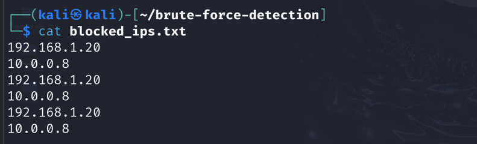
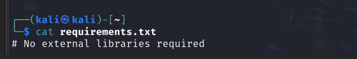

# Brute Force Detection & Response System
## Description
A Python-based SOC project that detects brute-force attacks and simulates automated incident response.
## Features
- Failed login detection
- Brute force alerting
- Automated IP blocking (simulation)
- SOC-style incident handling
## Tools Used
- Python
- Log Analysis
- Incident Response
---
## 🪜 Step-by-Step Execution
### 📁 Project Structure

### 📄 Authentication Log File (`auth_logs.txt`)
Simulated login attempts from various IPs.

### 🧠 Python Detection Script (`detector.py`) Threshold-based logic to detect brute force attacks.

### ▶️ Script Execution Running the detection script and observing alerts.

### 🚨 Alerts File (`alerts.txt`) Alerts generated for suspicious IPs.

### ⛔ Blocked IPs File (`blocked_ips.txt`) IPs blocked after detection.

### 📦 Folder Rename Organizing the project directory.

### 📦 Requirements File No external libraries required.

---
## 🧠 Detection Logic
- Count failed login attempts per IP
- If failed attempts ≥ 3 → trigger alert + block IP
- Detection type: **Threshold-Based Detection**
---
## 🛡️ Cybersecurity Relevance
| Project Feature | Real SOC Equivalent |
|-----------------------|-------------------------|
| Log analysis | SIEM (Splunk, ELK) |
| Threshold detection | IDS/IPS rules |
| Alerts | SOC monitoring |
| IP blocking | Firewall / Fail2Ban |
| Python automation | SOAR workflows |
---
## ✅ Outcome
This project demonstrates practical skills in:
- Log analysis
- Threat detection
- Alerting and response
- Python scripting
- SOC simulation
It strengthens your cybersecurity portfolio and supports internship/job applications in SOC, IT support, and threat detection roles.
---
## 📚 References
- OWASP Brute Force Attack Guide
- Fail2Ban Documentation
- Snort IDS Rules
- Splunk SIEM Concepts
## Use Case
SOC Analyst | Cyber Security Intern
## Ethical Use
For defensive and educational purposes only.
## Author
Aziz Ul Haq
