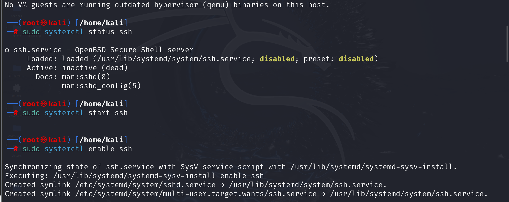
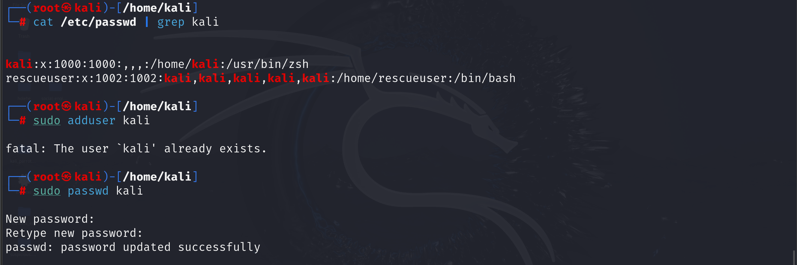
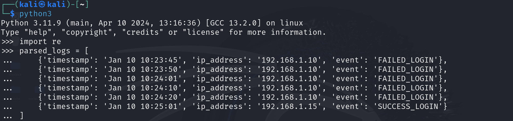

# 🛡️ SOC-SIEM Incident Detection System

This project simulates a simplified **Security Operations Center (SOC)** workflow using **SIEM principles** to detect suspicious SSH login activity. It includes log collection, parsing, and rule-based threat detection using Python.

🔗 [GitHub Repository](https://github.com/Azizulhaq-professional/Aziz-Cybersecurity-Labs/tree/main/SOC_SIEM_Incident_Detection_System)

---

## 📁 Project Structure

| Step | Description |
|------|-------------|
| **Step 1** | Log Collection & Understanding (SSH login attempts, user management, raw logs) |
| **Step 2** | Log Parsing with Python (IP, timestamp, event type) |
| **Step 3** | Threat Detection Rules (brute-force, suspicious IPs, repeated failures) |

---

## 🚀 Workflow Overview

### 🔍 Step 1: Log Collection & SSH Setup

- SSH service setup using `systemctl`
- SSH login attempts with failed authentication
- User creation and password update
- Viewing raw logs from `/var/log/auth.log`

📸 **Screenshots:**
- 
- 

---

### 🧠 Step 2: Log Parsing (Python)

Python script extracts:
- IP address  
- Timestamp  
- Event type (login failed / success)

📸 **Screenshot:**
- 

---

### 🚨 Step 3: Threat Detection Rules

Implemented rules:
1. Repeated failed logins  
2. Brute-force attack detection  
3. Suspicious IP flagging  
4. Success after multiple failures

📸 **Screenshot:**
- 

---

## 📄 Documentation

- 📘 [SOC_SIEM_Incident_Detection_Report.pdf](SOC_SIEM_Incident_Detection_Report.pdf)  
- 📘 [SOC_SIEM_Incident_Detection_System.pdf](SOC_SIEM_Incident_Detection_System.pdf)

---

## 🧪 Technologies Used

- **Python**: log parsing and rule logic  
- **Linux**: SSH service and log generation  
- **Jupyter Notebook**: analysis and documentation

---

## 🙌 Author

**Aziz Ul Haq**  
Cybersecurity & Data Science Enthusiast  
📍 Rawalpindi, Pakistan  
🔗 [GitHub Profile](https://github.com/Azizulhaq-professional)

---

✨ Feel free to explore, fork, and contribute. This project is ideal for SOC analysts, cybersecurity learners, and Python enthusiasts building hands-on detection systems.
