# Splunk Installation Guide 🛠️

This project documents the installation and configuration of **Splunk Enterprise on Ubuntu VM** with step‑by‑step screenshots.  
It is part of the **Aziz Cybersecurity Labs** repository, designed to provide practical, hands‑on security monitoring experience.

---

## 📂 Repository Structure
- **Splunk-Installation-Guide/**
  - `README.md` (this guide)
  - `Splunk/` (screenshots of installation process)

---

## 🚀 Installation Steps with Screenshots

### 1. Ubuntu Setup
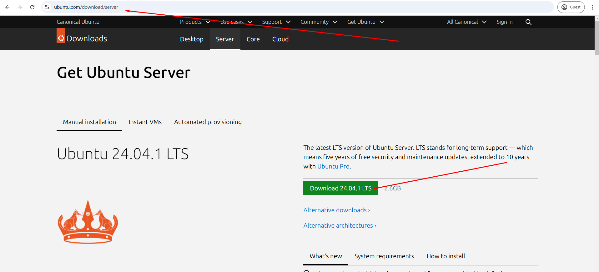  
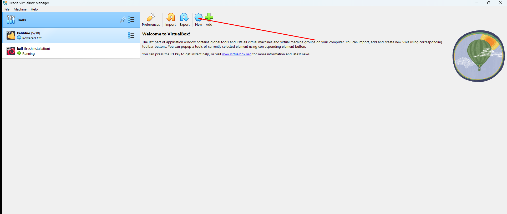  
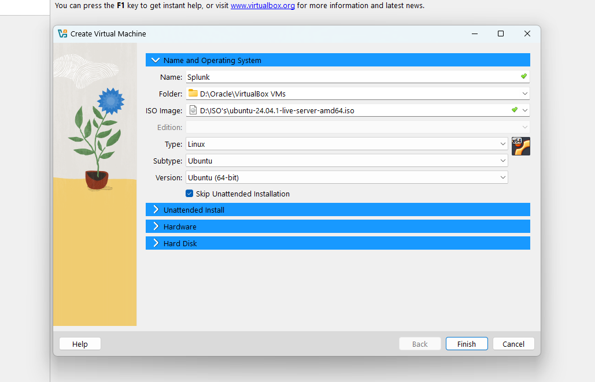  
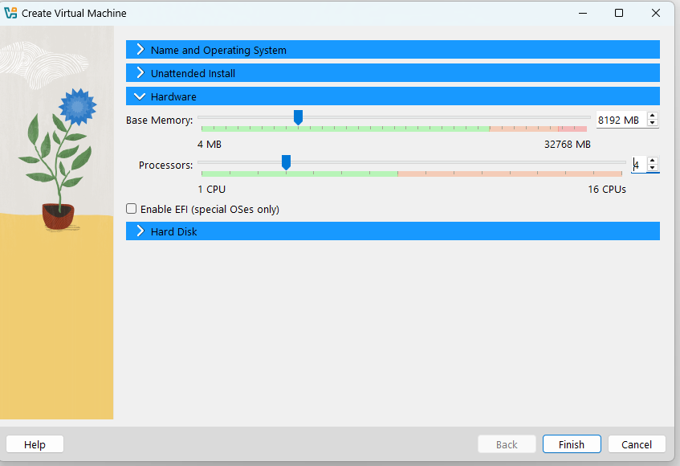  
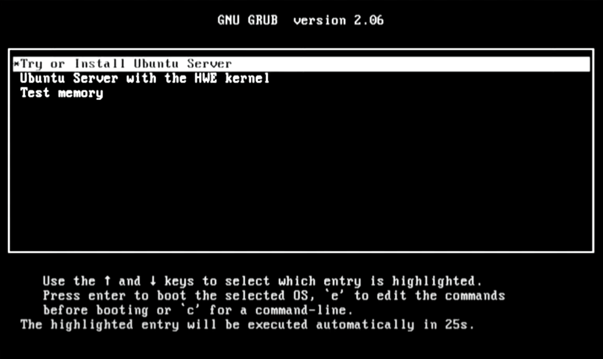

---

### 2. Profile & SSH
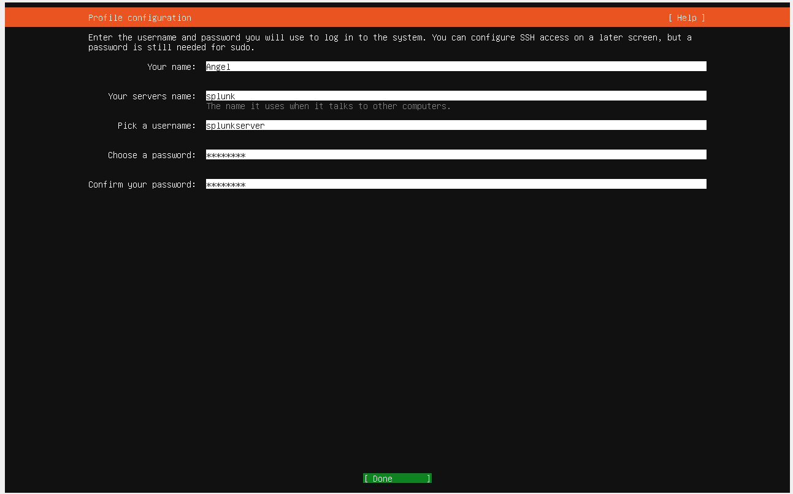  
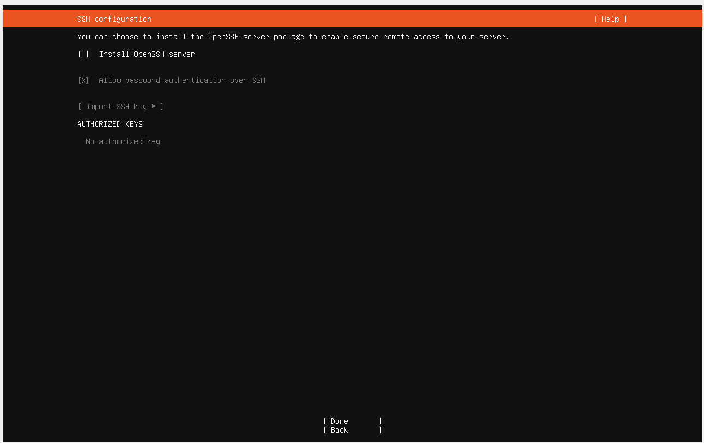  
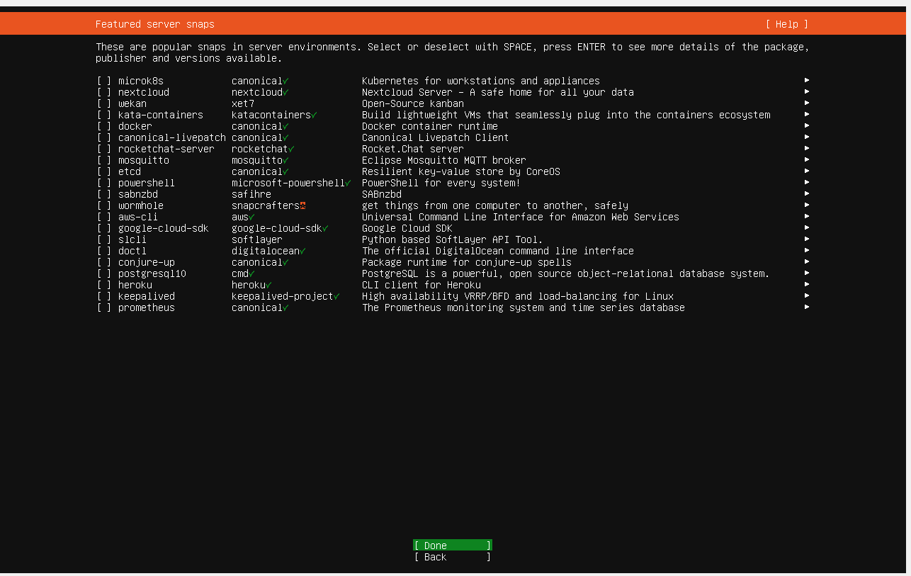  
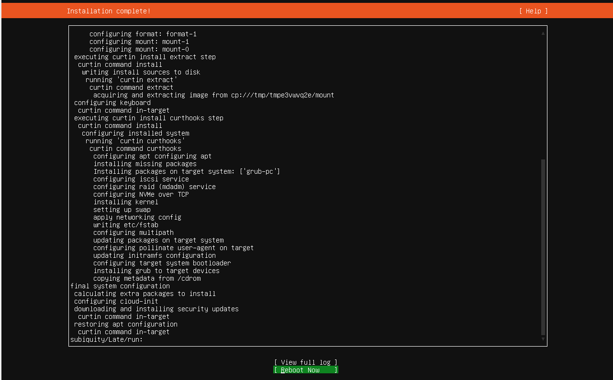

---

### 3. Updates & Network
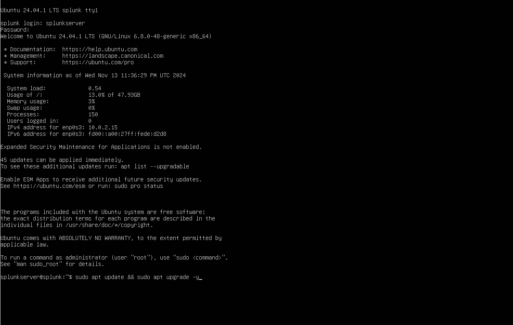  
  
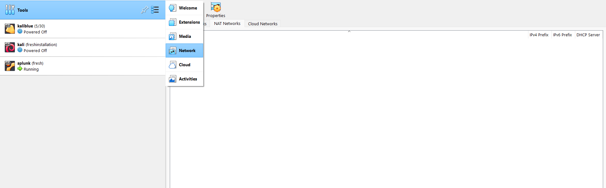  
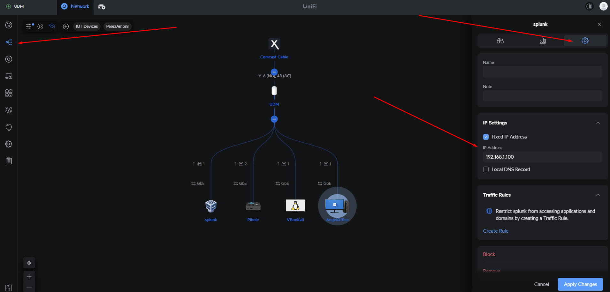  
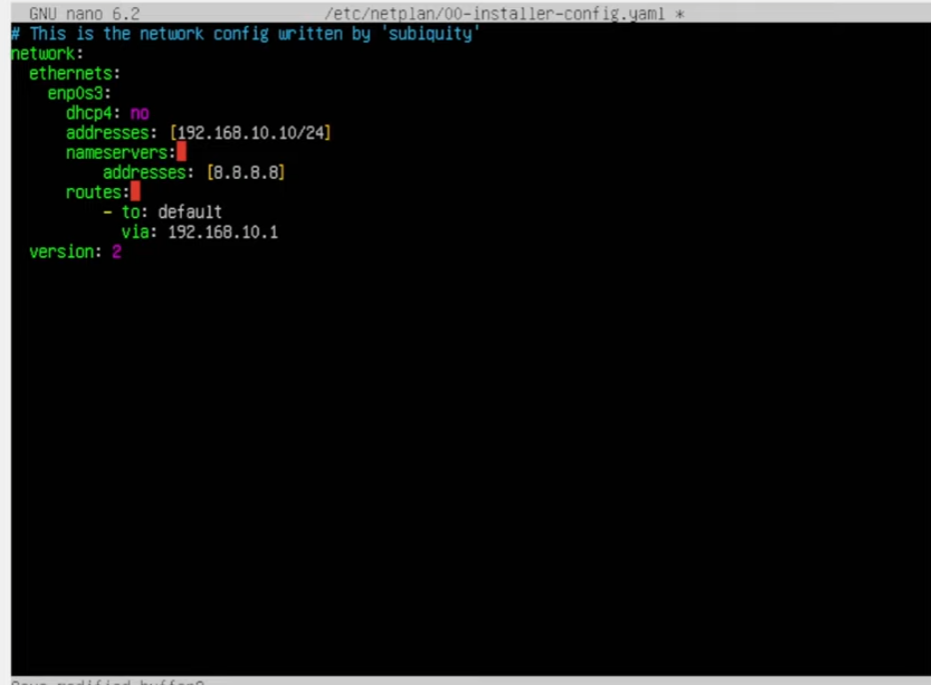  
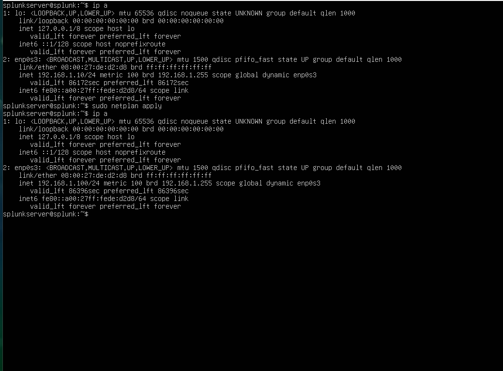

---

## ✅ Outcome
After completing these steps, Splunk Enterprise is successfully installed and accessible via the configured static IP.  
This lab provides a **visual reference** for troubleshooting and replicating Splunk setup in cybersecurity environments.

---

## 🔗 Related Labs
- [01_Vulnerability_Assessment_Lab](../01_Vulnerability_Assessment_Lab)  
- [05_SOC_SIEM_Incident_Detection](../05_SOC_SIEM_Incident_Detection_System)  
- [AI-Intrusion-Detection-System](../AI-Intrusion-Detection-System)

---

## 📌 Author
**Aziz Ul Haq**  
- GitHub: [Azizulhaq-professional](https://github.com/Azizulhaq-professional)  
- Cybersecurity & AI/ML Enthusiast  
