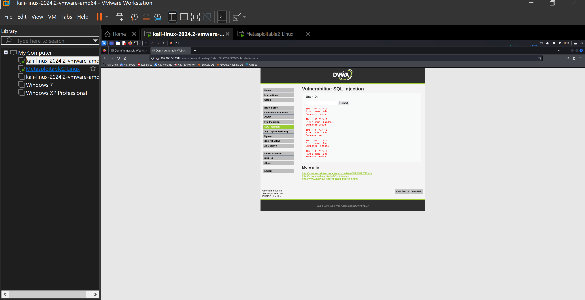

# Web Application Security Report
This project documents vulnerability testing performed on DVWA using Kali Linux. It includes:
- SQL Injection
- Reflected XSS
- Command Injection
## Tools Used
- Kali Linux
- DVWA
- Firefox Browser
## Vulnerabilities Tested
| Vulnerability | Payload Used | Result Observed | Risk Description |
|---------------------|----------------------------|---------------------------------------------|-----------------------------------------|
| SQL Injection | `' OR '1'='1` | All users listed | Database compromise |
| XSS (Reflected) | `` | Alert box triggered | Session hijacking |
| Command Injection | `127.0.0.1; whoami` | Server responded with `www-data` | Server takeover |
## Recommendations
- Input validation
- Prepared statements
- Output encoding
## Files Included
- `dvwa-web-vulnerability-report.pdf`
- `Web_Application_Security_Scanner.pdf`
- Screenshots folder  
[Download Web Application Security Scanner](Web_Application_Security_Scanner.pdf)

[Download DVWA Vulnerability Report](dvwa-web-vulnerability-report.pdf)
### SQL Injection Result

### XSS Alert Box

### Command Injection

